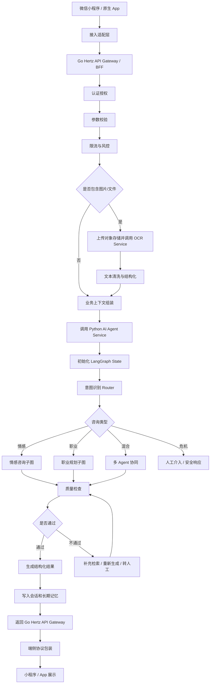
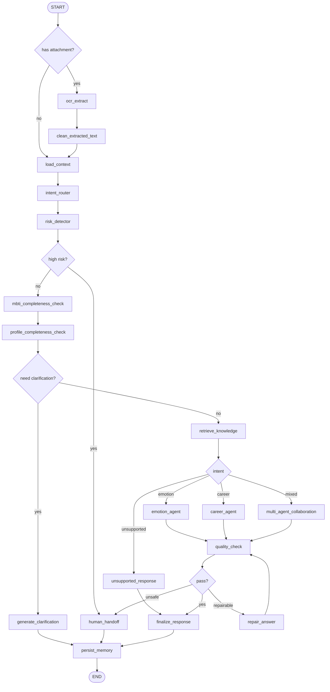
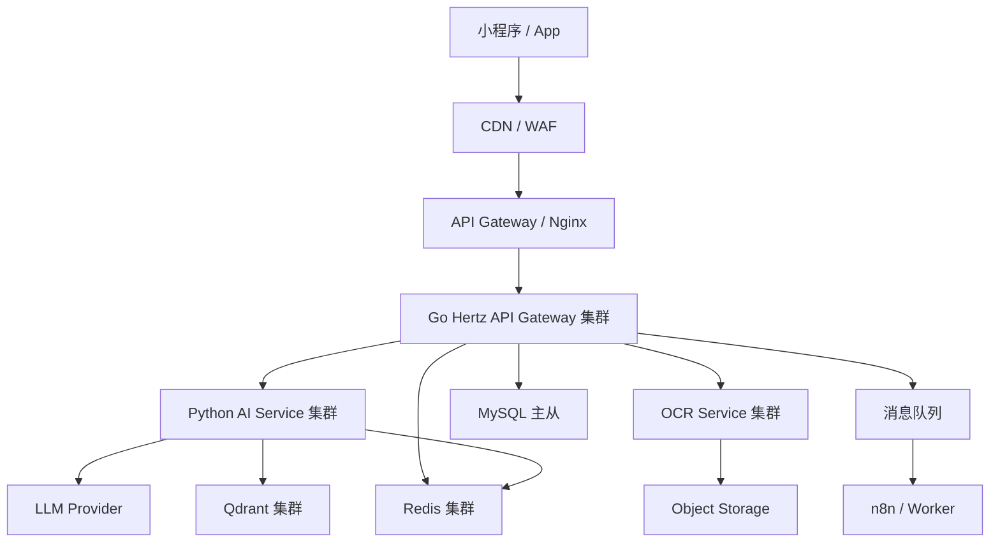

# 基于 LangGraph 的智能咨询 Agent 系统落地方案

本文档设计一套支持微信小程序和原生 App 接入的智能咨询 Agent 系统。系统面向情感咨询、职业规划咨询以及后续更多咨询方向扩展，采用多端适配、业务服务与 AI 服务解耦、LangGraph 工作流编排的分层架构。

## 0. 项目命名方案

### 0.1 推荐名称

推荐中文名：**知途**

推荐英文名：**ZhiPath**

产品定位语：

```text
知己，知路，走好下一步。
```

推荐理由：

- **有认知感**：`知途` 同时表达“理解自己”和“看清路径”，非常贴合陪伴、洞察、决策、成长的产品本质。
- **好记**：两个汉字，读音简单，适合小程序名、公众号名、抖音账号名。
- **不局限**：不会被限制在“情感咨询”或“职业规划”单一方向，后续可扩展到亲子、成长、学习、财富等方向。
- **适合商业化**：比“AI咨询助手”更像一个品牌，也更容易做内容引流和用户信任。
- **转化表达强**：用户能直观理解这是一个帮自己看清方向、规划路径的产品。

建议使用：

```text
App/小程序名称：知途
品牌全称：知途 AI
英文名：ZhiPath
仓库名：zhipath-ai 或 zhipath
服务前缀：zhipath
```

### 0.2 备选名称

| 中文名 | 英文名 | 市面冲突 | 含义 | 适合度 |
| --- | --- | --- | --- | --- |
| 知途 | ZhiPath | 需上线前进一步做商标/小程序/域名核查 | 知己，知路，认清自己和人生路径 | 最推荐，简洁、好记、有成长感 |
| 择道 | PathWise | 需上线前进一步做商标/小程序/域名核查 | 选择方向，做关键决策 | 非常适合职业规划和决策场景 |
| 下一步 | NextStep | 通用词较多，需重点核查 | 直接指向用户当下最需要的行动 | 转化强，适合作为功能入口或营销页标题 |
| 明舟 | Mingzhou AI | 暂无公开成品 AI 冲突 | 明确方向，渡过困境 | 温暖、好记，可作为备选 |
| 知行灯 | Zhixing AI | 暂无公开商用成品冲突 | 源自“知行合一”，强调知道也要行动 | 很适合决策教练，但名字稍长 |
| 临川 | Linchuan AI | 暂无公开正规 AI 服务冲突 | 临水观心，有沉静感 | 有意境，但产品识别度略弱 |
| 观澜 | Guanlan AI | 已存在海康安防多模态大模型、开源工具等 | 观变化、识趋势 | 建议避让 |
| 问津 | Wenjin AI | 已存在长亭科技安全垂直大模型 | 寻路求解 | 建议避让 |

最终建议选择 **知途 / ZhiPath**。本项目后续文档默认使用 `zhipath` 作为项目代号。

## 1. 整体架构设计

### 1.1 技术选型

推荐技术栈如下：

| 模块 | 技术选型 | 说明 |
| --- | --- | --- |
| 微信小程序 | TypeScript、Taro 或原生小程序 | 主变现入口，适合轻量咨询和报告展示 |
| 原生 App | Flutter、React Native、Swift/Kotlin | 支持更强的推送、流式体验和本地缓存 |
| API/BFF 层 | Go、Hertz | 负责认证、用户、订单、限流、多端协议适配 |
| AI 服务层 | Python、FastAPI、LangGraph | 负责 Agent 工作流、模型调用、RAG、质量检查 |
| OCR 服务 | Python、FastAPI、PaddleOCR | 负责图片、截图、简历、聊天记录等内容识别 |
| 数据库 | MySQL | 用户、会话、订单、消息、长期用户画像、决策轨迹 |
| 缓存 | Redis | 用户态缓存、限流、幂等、热点查询 |
| 向量库 | Qdrant | 知识库检索、语义记忆、相似问题召回 |
| 异步任务 | Redis Queue、Celery、Kafka 或 RabbitMQ | 报告生成、回访、异步写入、运营触达 |
| 自动化 | n8n | 定时回访、消息推送、运营流程 |
| 部署 | Docker、Nginx、Kubernetes | 支持水平扩展和灰度发布 |

### 1.2 Docker-first 与云服务替换原则

本地开发和首个可运行版本优先使用 Docker Compose，所有外部资源通过接口和环境变量接入，业务代码不得绑定具体云厂商。

| 能力 | 本地 Docker 默认实现 | 未来外部实现 | 代码边界 |
| --- | --- | --- | --- |
| 关系数据库 | MySQL 8.4 | 云 MySQL / RDS | `RelationalStore` |
| 缓存与短期状态 | Redis 7 | 云 Redis | `CacheStore`、`CheckpointStore` |
| 向量数据库 | Qdrant | Qdrant Cloud 或其他兼容适配器 | `VectorStore` |
| 对象存储 | MinIO | S3、OSS、COS、TOS | `ObjectStore` |
| 自动化 | n8n | 外部 n8n 或云工作流 | `AutomationClient` |
| 模型 | Mock / OpenAI-compatible endpoint | DeepSeek、OpenAI、Claude | `ModelProvider` |
| 消息任务 | Redis Streams | Kafka、RabbitMQ、云消息队列 | `EventBus` |

替换要求：

- 应用只读取 `MYSQL_DSN`、`REDIS_URL`、`QDRANT_URL`、`S3_ENDPOINT`、`N8N_BASE_URL` 等配置。
- 本地和云端使用相同接口契约；替换云服务不得修改领域逻辑和 LangGraph 节点。
- 数据库结构通过 migration 管理，禁止服务启动时自动修改生产表结构。
- MySQL 是业务事实源；Qdrant、Redis、n8n 都是可重建或可重放的派生系统。
- MySQL 到 Qdrant/n8n 的同步使用 transactional outbox 和幂等消费者，避免跨存储双写不一致。

### 1.3 分层架构

```text
微信小程序 / 原生 App
  ↓
多端接入适配层
  ↓
Go Hertz API Gateway / BFF
  ↓
业务服务层
  ↓
Python AI Agent Service
  ↓
LangGraph 咨询工作流
  ↓
模型服务 / RAG / 工具系统
  ↓
MySQL / Redis / Qdrant / Object Storage
```

### 1.4 记忆层设计

本项目不是普通聊天机器人，而是“长期陪伴型决策系统”。记忆层是核心能力，必须拆成三类：

| 记忆类型 | 推荐组件 | 作用 | 示例 |
| --- | --- | --- | --- |
| 短期记忆 | Redis / LangGraph state | 当前对话上下文、短时间连续交流 | 当前问题、最近几轮对话、临时追问状态 |
| 长期记忆 | MySQL | 用户画像、职业信息、会员状态、决策轨迹 | 年龄、职业、收入、MBTI、历史目标 |
| 语义记忆 | Qdrant | 相似问题召回、个性化建议、重要情绪节点 | 用户说过的重要话、关键问题、历史咨询摘要 |

推荐组合：

```text
短期记忆：Redis
长期记忆：MySQL
语义记忆：Qdrant
```

用户画像示例：

```json
{
  "user_id": "u_001",
  "profile": {
    "age": 30,
    "career": "Java开发",
    "income": "12k",
    "mbti": "ESFJ"
  },
  "history": [
    "想转Go",
    "焦虑找工作"
  ],
  "decisions": [
    "尝试面试阿里外包",
    "学习Go"
  ]
}
```

向量记忆建议写入：

- 用户说过的关键原话。
- 重要情绪节点。
- 职业目标变化。
- 重大决策记录。
- Agent 生成的阶段性总结。

这三层记忆的边界必须清晰：Redis 解决“当前聊到哪”，MySQL 解决“用户是谁”，Qdrant 解决“如何召回相似经历和个性化上下文”。

### 1.5 项目组织方式

推荐采用 `monorepo + 多服务独立启动` 的方式：

```text
zhipath-ai/
├── apps/
│   ├── miniapp/                 # 微信小程序
│   ├── mobile-app/              # 原生 App，后期接入
│   └── admin-web/               # 管理后台，后期接入
├── services/
│   ├── api-gateway/             # Go Hertz，统一 API 入口
│   ├── ai-agent-service/        # Python FastAPI + LangGraph
│   ├── ocr-service/             # Python FastAPI + PaddleOCR
│   ├── knowledge-service/       # 知识库导入、检索、版本管理，可后期拆出
│   └── worker-service/          # 异步任务、报告生成、回访触发
├── packages/
│   ├── shared-types/            # 多端共享类型
│   └── api-client/              # 小程序/App 调用 SDK
├── infra/
│   ├── docker-compose.yml
│   ├── nginx/
│   ├── k8s/
│   └── scripts/
├── docs/
└── README.md
```

维护方式：

- 一个仓库统一维护代码、文档、接口协议和部署配置。
- 每个服务有独立依赖、独立启动命令、独立端口和独立容器镜像。
- 本地开发通过 `docker-compose` 一键拉起依赖和核心服务。
- 生产部署时，每个服务独立扩容，避免 OCR、AI 推理、业务 API 互相影响。

独立服务启动示例：

```text
api-gateway          -> go run ./cmd/server
ai-agent-service     -> uvicorn app.main:app --host 0.0.0.0 --port 8001
ocr-service          -> uvicorn app.main:app --host 0.0.0.0 --port 8002
worker-service       -> python worker.py
miniapp              -> pnpm dev:weapp
```

MVP 阶段至少保留三个独立服务：

```text
api-gateway：Go Hertz，负责业务入口、登录、订单、会话、多端适配
ai-agent-service：Python，负责 LangGraph、RAG、模型、质量检查
ocr-service：Python，负责 PaddleOCR，可先预留接口后接入实现
```

### 1.6 各层职责

#### 多端入口层

负责用户交互，包括聊天、测评、报告、支付、反馈和人工咨询入口。入口层不直接访问 AI 服务，只调用统一的业务 API。

#### 多端接入适配层

负责屏蔽小程序和 App 的差异：

- 微信小程序：处理 `openid`、`unionid`、微信支付、订阅消息、小程序渠道参数。
- 原生 App：处理 App 登录、设备信息、推送 token、App 版本、渠道信息。

适配层统一输出 `ClientContext`：

```json
{
  "client_type": "wechat_miniapp",
  "app_version": "1.0.0",
  "platform": "ios",
  "device_id": "device_xxx",
  "channel": "douyin",
  "locale": "zh-CN"
}
```

#### Go Hertz API Gateway / BFF 层

负责：

- 认证授权
- 参数校验
- 限流熔断
- 请求日志
- 幂等控制
- 会员权益检查
- 会话与消息写入
- 调用 Python AI 服务
- 统一响应格式包装

#### 业务服务层

建议拆分为以下领域模块：

- `UserService`：用户账户、登录态、实名状态。
- `ProfileService`：用户画像、测评结果、长期档案。
- `ConversationService`：会话、消息、摘要、上下文。
- `OrderService`：会员、深度报告、一对一咨询订单。
- `FeedbackService`：用户反馈、评分、投诉。
- `RiskService`：风险状态、人工介入、黑名单和风控记录。

#### Python AI Agent Service

负责：

- 接收标准化咨询请求。
- 初始化 LangGraph 状态。
- 执行情感咨询、职业规划、混合咨询等工作流。
- 调用模型、知识库、工具和质量检查节点。
- 输出结构化咨询结果。
- 将 Agent 中间过程写入运行记录。

#### OCR Service

OCR 服务建议独立部署，不要直接放进 `ai-agent-service` 内部。

职责：

- 接收图片、截图、PDF 页面图片等文件 ID。
- 从对象存储读取原始文件。
- 使用 PaddleOCR 识别文本、段落和表格。
- 对识别结果做清洗、脱敏和结构化。
- 将识别结果返回给 Go Hertz API Gateway 或 AI Agent 服务。

适用场景：

- 职业规划：简历截图、招聘 JD 截图、Offer、薪资单、绩效反馈、测评报告。
- 情感咨询：聊天记录截图、私信截图、手写记录、咨询记录。

独立部署原因：

- PaddleOCR 依赖较重，和 LangGraph 服务放在一起会增加启动、镜像和扩容成本。
- OCR 属于计算密集型任务，流量高时需要单独扩容。
- 图片和文档包含隐私内容，独立服务更便于权限、审计和脱敏控制。

#### 数据存储层

负责持久化用户、会话、消息、知识库、语义记忆、运行轨迹和反馈数据。

#### 数据所有权

```text
Go Hertz API Gateway：
  MySQL 业务数据唯一写入入口
  用户、画像、MBTI、会话、消息、订单、分析结果、Outbox

Python AI Agent Service：
  读取标准化上下文
  执行 LangGraph
  返回结构化分析结果、运行指标和待持久化事件
  不直接修改用户、订单、画像等业务事实

Worker Service：
  消费 MySQL outbox_events
  幂等写入 Qdrant
  触发 n8n
  生成异步报告

OCR Service：
  读取对象存储文件并返回识别结果
  不直接修改业务数据库
```

所有跨服务调用必须携带 `trace_id`、`request_id` 和内部服务凭证。公网请求中的 `user_id` 不可信，Go 服务必须从登录态派生当前用户，并校验资源归属。

## 2. 完整执行流程设计

### 2.1 请求链路



### 2.2 统一请求接口

```http
POST /api/v1/consultations/{conversation_id}/messages
```

请求体：

```json
{
  "user_id": "u_001",
  "message": "我最近很迷茫，不知道该不该换工作",
  "consultation_type": "auto",
  "attachments": [
    {
      "file_id": "file_xxx",
      "file_type": "image",
      "ocr_status": "completed",
      "ocr_text": "招聘JD截图识别后的文本..."
    }
  ],
  "client_context": {
    "client_type": "wechat_miniapp",
    "app_version": "1.0.0",
    "platform": "ios",
    "channel": "douyin"
  }
}
```

### 2.3 统一响应结构

```json
{
  "conversation_id": "c_001",
  "message_id": "m_002",
  "domain": "mixed",
  "answer_type": "final_answer",
  "answer": "你这个问题同时包含职业决策和情绪压力...",
  "structured_result": {
    "problem_essence": "职业不确定性引发的焦虑",
    "options": [],
    "recommended_plan": [],
    "next_actions": []
  },
  "need_human_handoff": false,
  "quality_score": 23,
  "trace_id": "trace_xxx"
}
```

### 2.4 流式与异步响应

对于短咨询，直接同步返回。对于深度报告、长答案或模型排队场景，采用异步任务：

```text
客户端提交消息
  ↓
服务端返回 task_id
  ↓
客户端轮询或使用 SSE/WebSocket 接收状态
  ↓
报告生成完成后返回结果
```

微信小程序优先使用轮询或分段 HTTP；原生 App 可以使用 SSE 或 WebSocket。

### 2.5 MBTI 人格测试补全流程

职业规划和情感咨询都需要使用用户 MBTI。对于深度分析，分析依据按以下优先级组织：

```text
第一依据：用户当前的真实经历、目标、资源、约束和风险
第二依据：用户当前确认生效的完整 MBTI 测试结果
第三依据：历史咨询、决策轨迹、语义记忆和专业知识库
```

MBTI 是除用户现实情况之外的主要分析依据，必须进入情感咨询、职业规划和决策教练的分析上下文；但它不能覆盖用户现实事实，也不能用于心理疾病诊断或形成确定性结论。

当用户进入以下场景时，系统需要提醒用户尽量先补充 MBTI：

- 申请深度职业规划。
- 申请深度情感咨询。
- 用户问题涉及长期性格模式、关系沟通方式、职业偏好、决策风格。
- 用户画像中没有 MBTI，或 MBTI 结果过旧、来源不明。

深度分析规则：

- 用户已有已确认且有效的 MBTI：直接加载完整测试结果后进入深度分析。
- 用户没有 MBTI：先明确提醒完成测试并分享结果。
- 用户选择暂不测试：允许继续，但只能生成“基础分析”，不能标记为“MBTI 深度分析”。
- 用户重新测试：保留历史结果，将用户最新确认的结果设置为当前生效版本。

推荐引导文案：

```text
为了让建议更贴合你的沟通方式、决策习惯和职业偏好，建议你先完成一次 MBTI 人格测试。

你可以前往：
http://16personalities.com/ch/%E4%BA%BA%E6%A0%BC%E6%B5%8B%E8%AF%95

完成后把结果类型（如 INFP-T、ENTJ-A）和各维度比例分享给我；也可以上传测试结果截图，我会帮你识别并整理进你的个人画像。
```

MBTI 信息采集方式：

```text
1. 用户手动填写：类型、A/T、四维比例、测试时间。
2. 用户上传截图：通过 OCR Service 识别结果，再由 AI Service 结构化。
3. 用户只知道类型：先保存基础类型，后续引导补充维度比例。
```

保存后的 MBTI 会写入：

```text
user_profiles.mbti_type
user_profiles.mbti_assertiveness
user_profiles.mbti_source
user_mbti_results
user_memory_items
Qdrant user memory
```

每次分析还必须生成 MBTI 使用快照：

```text
agent_runs.mbti_result_id
agent_runs.mbti_snapshot
decision_records.mbti_result_id
decision_records.mbti_snapshot
```

这样可以追溯某次结论使用的是哪一次 MBTI 测试，避免用户更新测试结果后历史报告失去依据。

Agent 使用规则：

- 情感咨询：参考用户表达方式、冲突处理偏好、亲密关系沟通方式。
- 职业规划：参考用户工作偏好、协作模式、压力反应、决策习惯。
- 决策教练：参考用户风险偏好、行动阻力、适合的计划颗粒度。
- 深度分析输出必须单独包含“MBTI 参考分析”部分，并说明它与用户现实情况如何相互印证或存在冲突。
- 回答中必须避免“你是某类型，所以你一定……”这类绝对化表达。
- 输出时建议写成“结合你提供的 MBTI 结果，可能更适合……”。

## 3. LangGraph 图结构设计

### 3.1 State 结构

```python
from typing import Any, Literal, TypedDict


class ConsultationState(TypedDict, total=False):
    trace_id: str
    user_id: str
    conversation_id: str
    message: str

    client_type: Literal["wechat_miniapp", "ios", "android", "web"]
    consultation_type: Literal["auto", "emotion", "career"]

    attachments: list[dict[str, Any]]
    extracted_text: str
    ocr_status: Literal["none", "pending", "completed", "failed"]

    user_profile: dict[str, Any]
    mbti_profile: dict[str, Any]
    mbti_missing: bool
    should_prompt_mbti: bool
    short_term_memory: list[dict[str, Any]]
    long_term_memory: list[dict[str, Any]]

    intent: Literal["emotion", "career", "mixed", "crisis", "unsupported"]
    intent_confidence: float

    missing_fields: list[str]
    need_clarification: bool
    clarification_questions: list[str]

    retrieved_docs: list[dict[str, Any]]
    agent_outputs: dict[str, Any]

    draft_answer: str
    structured_result: dict[str, Any]

    quality_score: int
    safety_risk_level: Literal["none", "low", "medium", "high", "critical"]
    need_human_handoff: bool

    final_answer: str
    next_actions: list[dict[str, Any]]
```

### 3.2 图结构



### 3.3 节点职责

| 节点 | 职责 |
| --- | --- |
| `ocr_extract` | 对图片、截图、PDF 页面图片调用 OCR Service，获取识别文本 |
| `clean_extracted_text` | 清洗 OCR 文本，去除噪声、重复行和明显识别错误 |
| `load_context` | 读取用户画像、最近对话、长期记忆、会员权益 |
| `intent_router` | 判断情感、职业、混合、危机、不支持 |
| `risk_detector` | 检测自伤、自杀、家暴、未成年人风险、极端情绪 |
| `mbti_completeness_check` | 检查用户是否已有 MBTI；深度咨询缺失时生成测试提醒或结果上传提示 |
| `profile_completeness_check` | 判断是否缺少关键咨询信息 |
| `generate_clarification` | 生成 1-3 个关键追问 |
| `retrieve_knowledge` | 按咨询类型检索知识库和长期记忆 |
| `emotion_agent` | 情感分析、共情回应、沟通建议、风险边界 |
| `career_agent` | 职业定位、技能差距、路径规划、行动计划 |
| `multi_agent_collaboration` | 情感分析师、职业规划师、决策教练协同 |
| `quality_check` | 事实核查、安全合规、可执行性评分 |
| `repair_answer` | 根据质量问题补充检索、重写或降风险表达 |
| `human_handoff` | 人工介入、安全提示、服务升级 |
| `finalize_response` | 生成最终结构化响应 |
| `persist_memory` | 保存消息、摘要、用户画像变化和 Agent 运行记录 |

### 3.4 循环控制

`repair_answer` 最多循环 2 次。若仍不通过质量检查，则进入人工介入或返回保守回答。

```text
quality_check failed
  ↓
repair_answer
  ↓
quality_check
  ↓
最多 2 次
  ↓
human_handoff / conservative_response
```

### 3.5 OCR 条件节点设计

OCR 不作为所有请求的必经节点，只在 `attachments` 非空时执行。

```text
用户仅输入文本
  -> 跳过 OCR
  -> load_context

用户上传图片/文件
  -> ocr_extract
  -> clean_extracted_text
  -> 将 extracted_text 合并到 message_context
  -> load_context
```

OCR 输出建议结构：

```json
{
  "file_id": "file_xxx",
  "ocr_status": "completed",
  "text": "识别后的正文",
  "blocks": [
    {
      "type": "paragraph",
      "text": "岗位要求：3年以上前端经验...",
      "confidence": 0.94
    }
  ],
  "quality": {
    "avg_confidence": 0.91,
    "need_manual_review": false
  }
}
```

低置信度处理：

- `avg_confidence >= 0.85`：直接进入 Agent 分析。
- `0.6 <= avg_confidence < 0.85`：提示用户确认识别内容。
- `avg_confidence < 0.6`：要求重新上传更清晰图片或转人工处理。

## 4. 中间件设计与使用方案

### 4.1 认证授权中间件

位置：Go Hertz API Gateway。

功能：

- 校验 JWT、Session、微信登录态、App token。
- 识别用户身份和会员权益。
- 限制未登录、匿名、免费用户的访问范围。

配置建议：

```text
免费用户：每日基础咨询 3 次
注册用户：每日基础咨询 10 次
会员用户：开放深度报告和长期记忆
高风险场景：强制进入人工介入或安全响应
```

### 4.2 请求日志中间件

位置：Go Hertz API Gateway 和 Python AI 服务。

记录字段：

```text
trace_id
user_id
client_type
path
status_code
latency_ms
model_used
token_usage
risk_level
quality_score
```

注意事项：

- 不在普通日志中明文记录咨询正文。
- 对敏感字段做脱敏或加密。
- 通过 `trace_id` 串联 Go 和 Python 服务日志。

### 4.3 限流熔断中间件

位置：网关、Go Hertz API Gateway、Python AI 服务。

限流维度：

- IP 级限流，防刷。
- 用户级限流，控制权益。
- 会话级限流，避免重复提交。
- 模型 provider 级熔断，防止外部模型异常拖垮系统。

推荐策略：

```text
普通消息：user_id 每分钟 10 次
深度报告：user_id 每小时 3 次
匿名用户：IP 每分钟 5 次
模型超时率超过阈值：切换 fallback 模型
```

### 4.4 参数校验中间件

位置：Go Hertz API Gateway 和 Python FastAPI。

校验规则：

- `message` 不为空。
- 文本长度限制，例如 1-3000 字。
- `conversation_id` 必须归属当前用户。
- `consultation_type` 只能是 `auto`、`emotion`、`career`。
- `client_type` 必须在白名单内。

### 4.5 缓存中间件

位置：Go Hertz API Gateway、AI 服务。

缓存对象：

| 数据 | 缓存位置 | TTL |
| --- | --- | --- |
| 用户基础画像 | Redis | 5-30 分钟 |
| 会员权益 | Redis | 1-5 分钟 |
| Prompt 模板 | 服务内存 | 配置更新时刷新 |
| 知识库检索结果 | Redis | 10-60 分钟 |
| 热门测评结果 | Redis | 1-24 小时 |

### 4.6 异常处理中间件

统一错误结构：

```json
{
  "code": "AI_MODEL_TIMEOUT",
  "message": "当前咨询服务繁忙，请稍后重试",
  "trace_id": "trace_xxx",
  "retryable": true
}
```

异常分类：

- 业务异常：参数错误、权益不足、会话不存在。
- AI 异常：模型超时、限流、内容安全拦截。
- 系统异常：数据库失败、Redis 失败、向量库失败。

### 4.7 其他中间件

- CORS 中间件：支持 Web 和 App 调试。
- 幂等中间件：通过 `request_id` 防止重复提交。
- 内容安全中间件：检测暴力、自伤、违法、色情等风险。
- 灰度中间件：按用户、渠道、版本切换不同 Prompt、模型和 LangGraph 版本。
- 观测中间件：Prometheus metrics、OpenTelemetry tracing。

## 5. 数据存储方案

当前阶段只做 C 端应用，不做 SaaS 平台。但为了后续平滑扩展为 SaaS，MySQL 业务表统一预留 `tenant_id` 字段。

MVP 阶段：

```text
tenant_id 固定为 default_consumer
```

未来 SaaS 阶段：

```text
tenant_id = 企业/机构/咨询师工作室 ID
```

### 5.1 MySQL 表设计总览

| 模块 | 表名 | 说明 |
| --- | --- | --- |
| 租户预留 | `tenants` | SaaS 预留，C 端阶段只有默认租户 |
| 用户 | `users` | C 端用户主表 |
| 用户 | `user_auth_identities` | 微信、手机号、App 登录身份 |
| 用户画像 | `user_profiles`、`user_mbti_results` | 长期结构化画像、MBTI 测试结果 |
| 会员权益 | `membership_plans`、`user_memberships` | 会员套餐和用户会员状态 |
| 会话消息 | `conversations`、`messages`、`conversation_summaries` | 对话、消息、摘要 |
| 决策记录 | `decision_records` | 用户关键决策和阶段变化 |
| 结构化记忆 | `user_memory_items` | 可查询、可编辑的长期记忆 |
| 文件 OCR | `files`、`ocr_results` | 文件元数据和 OCR 识别结果 |
| 订单支付 | `products`、`orders`、`payments` | 付费报告、会员、咨询服务 |
| Agent 运行 | `agent_runs`、`agent_node_outputs` | LangGraph 执行轨迹 |
| Prompt | `prompt_versions` | Prompt 版本管理 |
| 知识库 | `knowledge_documents`、`knowledge_chunks` | 知识库文档和 chunk 元数据 |
| 风险合规 | `risk_events`、`human_handoffs` | 危机识别、人工介入 |
| 反馈运营 | `feedbacks`、`followup_tasks` | 用户反馈、n8n 回访任务 |
| 可靠事件 | `outbox_events` | MySQL 到 Qdrant、n8n、异步报告的可靠同步 |

### 5.2 通用字段规范

除特殊关联表外，业务表建议统一包含：

```text
id BIGINT PRIMARY KEY AUTO_INCREMENT
tenant_id VARCHAR(64) NOT NULL DEFAULT 'default_consumer'
created_at DATETIME(3) NOT NULL
updated_at DATETIME(3) NOT NULL
deleted_at DATETIME(3) NULL
```

索引规范：

```text
idx_tenant_id: tenant_id
idx_user_id: user_id
idx_created_at: created_at
idx_tenant_user: tenant_id + user_id
```

数据隔离策略：

- C 端阶段所有数据使用 `tenant_id = default_consumer`。
- 所有查询都带上 `tenant_id`，避免未来 SaaS 改造时重写大量 SQL。
- 用户隐私内容，例如聊天原文、OCR 文本、风险事件详情，需要加密或脱敏存储。

### 5.3 租户预留表

表：`tenants`

```text
id BIGINT PRIMARY KEY AUTO_INCREMENT
tenant_id VARCHAR(64) NOT NULL UNIQUE
name VARCHAR(128) NOT NULL
type VARCHAR(32) NOT NULL DEFAULT 'consumer'
status VARCHAR(32) NOT NULL DEFAULT 'active'
settings JSON NULL
created_at DATETIME(3) NOT NULL
updated_at DATETIME(3) NOT NULL
```

MVP 默认数据：

```text
tenant_id = default_consumer
name = 知途 C 端应用
type = consumer
```

### 5.4 用户与登录

表：`users`

```text
id BIGINT PRIMARY KEY AUTO_INCREMENT
tenant_id VARCHAR(64) NOT NULL DEFAULT 'default_consumer'
user_id VARCHAR(64) NOT NULL UNIQUE
nickname VARCHAR(128) NULL
avatar_url VARCHAR(512) NULL
gender VARCHAR(16) NULL
birth_year INT NULL
city VARCHAR(64) NULL
status VARCHAR(32) NOT NULL DEFAULT 'active'
registered_channel VARCHAR(64) NULL
last_login_at DATETIME(3) NULL
created_at DATETIME(3) NOT NULL
updated_at DATETIME(3) NOT NULL
deleted_at DATETIME(3) NULL
```

表：`user_auth_identities`

```text
id BIGINT PRIMARY KEY AUTO_INCREMENT
tenant_id VARCHAR(64) NOT NULL DEFAULT 'default_consumer'
user_id VARCHAR(64) NOT NULL
provider VARCHAR(32) NOT NULL
provider_user_id VARCHAR(128) NOT NULL
union_id VARCHAR(128) NULL
phone_hash VARCHAR(128) NULL
credential_encrypted TEXT NULL
created_at DATETIME(3) NOT NULL
updated_at DATETIME(3) NOT NULL
UNIQUE KEY uk_provider_user (provider, provider_user_id)
```

`provider` 可选值：

```text
wechat_miniapp
wechat_union
phone
apple
android
```

### 5.5 用户画像与长期记忆

表：`user_profiles`

```text
id BIGINT PRIMARY KEY AUTO_INCREMENT
tenant_id VARCHAR(64) NOT NULL DEFAULT 'default_consumer'
user_id VARCHAR(64) NOT NULL UNIQUE
age_range VARCHAR(32) NULL
city VARCHAR(64) NULL
education VARCHAR(64) NULL
occupation VARCHAR(128) NULL
industry VARCHAR(128) NULL
work_years DECIMAL(4,1) NULL
income_range VARCHAR(64) NULL
skills JSON NULL
career_goal TEXT NULL
relationship_status VARCHAR(64) NULL
mbti_type VARCHAR(8) NULL
mbti_assertiveness VARCHAR(1) NULL
current_mbti_result_id VARCHAR(64) NULL
mbti_source VARCHAR(32) NULL
mbti_confidence DECIMAL(4,3) NULL
mbti_updated_at DATETIME(3) NULL
personality_tags JSON NULL
current_challenges JSON NULL
risk_flags JSON NULL
profile_completeness INT NOT NULL DEFAULT 0
created_at DATETIME(3) NOT NULL
updated_at DATETIME(3) NOT NULL
```

MBTI 字段说明：

```text
mbti_type：16 型人格基础类型，例如 INFP、ENTJ
mbti_assertiveness：A 或 T，例如 INFP-T 中的 T
current_mbti_result_id：当前生效且用户确认的 MBTI 测试记录
mbti_source：manual、ocr、imported、agent_extracted
mbti_confidence：结构化结果可信度
mbti_updated_at：用户最近一次确认 MBTI 的时间
```

表：`user_mbti_results`

```text
id BIGINT PRIMARY KEY AUTO_INCREMENT
tenant_id VARCHAR(64) NOT NULL DEFAULT 'default_consumer'
mbti_result_id VARCHAR(64) NOT NULL UNIQUE
user_id VARCHAR(64) NOT NULL
conversation_id VARCHAR(64) NULL
source VARCHAR(32) NOT NULL
test_url VARCHAR(1024) NULL
result_type VARCHAR(8) NOT NULL
assertiveness VARCHAR(1) NULL
energy_score INT NULL
mind_score INT NULL
nature_score INT NULL
tactics_score INT NULL
identity_score INT NULL
raw_text MEDIUMTEXT NULL
raw_payload JSON NULL
file_id VARCHAR(64) NULL
ocr_id VARCHAR(64) NULL
confidence_score DECIMAL(4,3) NOT NULL DEFAULT 0.800
confirmed_by_user BOOLEAN NOT NULL DEFAULT FALSE
tested_at DATETIME(3) NULL
created_at DATETIME(3) NOT NULL
updated_at DATETIME(3) NOT NULL
deleted_at DATETIME(3) NULL
```

分数字段说明：

```text
energy_score：外向 E / 内向 I 维度比例，按用户测试结果原样保存
mind_score：实感 S / 直觉 N 维度比例
nature_score：理性 T / 情感 F 维度比例
tactics_score：判断 J / 展望 P 维度比例
identity_score：坚决 A / 谨慎 T 维度比例
```

保存策略：

- 最新且用户确认的结果同步到 `user_profiles`。
- 所有历史测试结果保留在 `user_mbti_results`，用于观察用户自我认知变化。
- 通过 OCR 识别的结果必须标记 `source = ocr`，并保存 `file_id` 和 `ocr_id`。
- 用户只提供 `INFP-T` 这类简写时，允许只保存 `result_type` 和 `assertiveness`，维度比例为空。

表：`user_memory_items`

```text
id BIGINT PRIMARY KEY AUTO_INCREMENT
tenant_id VARCHAR(64) NOT NULL DEFAULT 'default_consumer'
memory_id VARCHAR(64) NOT NULL UNIQUE
user_id VARCHAR(64) NOT NULL
conversation_id VARCHAR(64) NULL
domain VARCHAR(32) NOT NULL
memory_type VARCHAR(64) NOT NULL
title VARCHAR(256) NULL
content TEXT NOT NULL
content_summary VARCHAR(512) NULL
importance_score DECIMAL(4,3) NOT NULL DEFAULT 0.500
confidence_score DECIMAL(4,3) NOT NULL DEFAULT 0.800
source VARCHAR(64) NOT NULL DEFAULT 'agent'
vector_point_id VARCHAR(128) NULL
expires_at DATETIME(3) NULL
created_at DATETIME(3) NOT NULL
updated_at DATETIME(3) NOT NULL
deleted_at DATETIME(3) NULL
```

`memory_type` 建议：

```text
profile_fact：用户事实
mbti_profile：MBTI 人格画像
career_goal：职业目标
emotion_pattern：情绪模式
decision_history：决策历史
risk_signal：风险信号
preference：偏好
```

### 5.6 会员与权益

表：`membership_plans`

```text
id BIGINT PRIMARY KEY AUTO_INCREMENT
tenant_id VARCHAR(64) NOT NULL DEFAULT 'default_consumer'
plan_id VARCHAR(64) NOT NULL UNIQUE
name VARCHAR(128) NOT NULL
description VARCHAR(512) NULL
price_cents BIGINT NOT NULL
currency VARCHAR(16) NOT NULL DEFAULT 'CNY'
duration_days INT NOT NULL
benefits JSON NOT NULL
status VARCHAR(32) NOT NULL DEFAULT 'active'
created_at DATETIME(3) NOT NULL
updated_at DATETIME(3) NOT NULL
```

表：`user_memberships`

```text
id BIGINT PRIMARY KEY AUTO_INCREMENT
tenant_id VARCHAR(64) NOT NULL DEFAULT 'default_consumer'
user_id VARCHAR(64) NOT NULL
plan_id VARCHAR(64) NOT NULL
status VARCHAR(32) NOT NULL DEFAULT 'active'
started_at DATETIME(3) NOT NULL
expired_at DATETIME(3) NOT NULL
remaining_deep_reports INT NOT NULL DEFAULT 0
created_at DATETIME(3) NOT NULL
updated_at DATETIME(3) NOT NULL
```

### 5.7 会话与消息

表：`conversations`

```text
id BIGINT PRIMARY KEY AUTO_INCREMENT
tenant_id VARCHAR(64) NOT NULL DEFAULT 'default_consumer'
conversation_id VARCHAR(64) NOT NULL UNIQUE
user_id VARCHAR(64) NOT NULL
domain VARCHAR(32) NOT NULL DEFAULT 'auto'
title VARCHAR(256) NULL
status VARCHAR(32) NOT NULL DEFAULT 'active'
summary TEXT NULL
risk_level VARCHAR(32) NOT NULL DEFAULT 'none'
last_message_at DATETIME(3) NULL
created_at DATETIME(3) NOT NULL
updated_at DATETIME(3) NOT NULL
deleted_at DATETIME(3) NULL
```

表：`messages`

```text
id BIGINT PRIMARY KEY AUTO_INCREMENT
tenant_id VARCHAR(64) NOT NULL DEFAULT 'default_consumer'
message_id VARCHAR(64) NOT NULL UNIQUE
conversation_id VARCHAR(64) NOT NULL
user_id VARCHAR(64) NOT NULL
role VARCHAR(32) NOT NULL
message_type VARCHAR(32) NOT NULL DEFAULT 'text'
content_encrypted MEDIUMTEXT NULL
content_summary VARCHAR(512) NULL
attachments JSON NULL
metadata JSON NULL
token_count INT NOT NULL DEFAULT 0
created_at DATETIME(3) NOT NULL
deleted_at DATETIME(3) NULL
```

表：`conversation_summaries`

```text
id BIGINT PRIMARY KEY AUTO_INCREMENT
tenant_id VARCHAR(64) NOT NULL DEFAULT 'default_consumer'
summary_id VARCHAR(64) NOT NULL UNIQUE
conversation_id VARCHAR(64) NOT NULL
user_id VARCHAR(64) NOT NULL
summary_type VARCHAR(32) NOT NULL
summary_text TEXT NOT NULL
covered_message_start_id VARCHAR(64) NULL
covered_message_end_id VARCHAR(64) NULL
vector_point_id VARCHAR(128) NULL
created_at DATETIME(3) NOT NULL
```

### 5.8 决策记录

表：`decision_records`

```text
id BIGINT PRIMARY KEY AUTO_INCREMENT
tenant_id VARCHAR(64) NOT NULL DEFAULT 'default_consumer'
decision_id VARCHAR(64) NOT NULL UNIQUE
user_id VARCHAR(64) NOT NULL
conversation_id VARCHAR(64) NULL
domain VARCHAR(32) NOT NULL
decision_title VARCHAR(256) NOT NULL
problem_essence TEXT NULL
mbti_result_id VARCHAR(64) NULL
mbti_snapshot JSON NULL
options JSON NULL
recommended_option TEXT NULL
risks JSON NULL
action_plan JSON NULL
status VARCHAR(32) NOT NULL DEFAULT 'open'
review_at DATETIME(3) NULL
outcome TEXT NULL
created_at DATETIME(3) NOT NULL
updated_at DATETIME(3) NOT NULL
```

该表用于沉淀“第 1 天迷茫、第 30 天做选择、第 90 天复盘结果”的成长轨迹。

### 5.9 文件与 OCR

表：`files`

```text
id BIGINT PRIMARY KEY AUTO_INCREMENT
tenant_id VARCHAR(64) NOT NULL DEFAULT 'default_consumer'
file_id VARCHAR(64) NOT NULL UNIQUE
user_id VARCHAR(64) NOT NULL
conversation_id VARCHAR(64) NULL
file_type VARCHAR(32) NOT NULL
mime_type VARCHAR(128) NULL
storage_url VARCHAR(1024) NOT NULL
sha256 VARCHAR(128) NOT NULL
size_bytes BIGINT NOT NULL
upload_client VARCHAR(64) NULL
status VARCHAR(32) NOT NULL DEFAULT 'uploaded'
created_at DATETIME(3) NOT NULL
deleted_at DATETIME(3) NULL
```

表：`ocr_results`

```text
id BIGINT PRIMARY KEY AUTO_INCREMENT
tenant_id VARCHAR(64) NOT NULL DEFAULT 'default_consumer'
ocr_id VARCHAR(64) NOT NULL UNIQUE
file_id VARCHAR(64) NOT NULL
user_id VARCHAR(64) NOT NULL
engine VARCHAR(64) NOT NULL DEFAULT 'paddleocr'
engine_version VARCHAR(64) NULL
status VARCHAR(32) NOT NULL
raw_result JSON NULL
clean_text MEDIUMTEXT NULL
avg_confidence DECIMAL(4,3) NULL
need_manual_review BOOLEAN NOT NULL DEFAULT FALSE
created_at DATETIME(3) NOT NULL
updated_at DATETIME(3) NOT NULL
```

### 5.10 订单与支付

表：`products`

```text
id BIGINT PRIMARY KEY AUTO_INCREMENT
tenant_id VARCHAR(64) NOT NULL DEFAULT 'default_consumer'
product_id VARCHAR(64) NOT NULL UNIQUE
product_type VARCHAR(32) NOT NULL
name VARCHAR(128) NOT NULL
description VARCHAR(512) NULL
price_cents BIGINT NOT NULL
currency VARCHAR(16) NOT NULL DEFAULT 'CNY'
status VARCHAR(32) NOT NULL DEFAULT 'active'
metadata JSON NULL
created_at DATETIME(3) NOT NULL
updated_at DATETIME(3) NOT NULL
```

表：`orders`

```text
id BIGINT PRIMARY KEY AUTO_INCREMENT
tenant_id VARCHAR(64) NOT NULL DEFAULT 'default_consumer'
order_id VARCHAR(64) NOT NULL UNIQUE
user_id VARCHAR(64) NOT NULL
product_id VARCHAR(64) NOT NULL
order_type VARCHAR(32) NOT NULL
amount_cents BIGINT NOT NULL
currency VARCHAR(16) NOT NULL DEFAULT 'CNY'
status VARCHAR(32) NOT NULL DEFAULT 'pending'
paid_at DATETIME(3) NULL
created_at DATETIME(3) NOT NULL
updated_at DATETIME(3) NOT NULL
```

表：`payments`

```text
id BIGINT PRIMARY KEY AUTO_INCREMENT
tenant_id VARCHAR(64) NOT NULL DEFAULT 'default_consumer'
payment_id VARCHAR(64) NOT NULL UNIQUE
order_id VARCHAR(64) NOT NULL
user_id VARCHAR(64) NOT NULL
provider VARCHAR(32) NOT NULL
provider_trade_no VARCHAR(128) NULL
amount_cents BIGINT NOT NULL
status VARCHAR(32) NOT NULL DEFAULT 'pending'
notify_payload JSON NULL
paid_at DATETIME(3) NULL
created_at DATETIME(3) NOT NULL
updated_at DATETIME(3) NOT NULL
```

### 5.11 Agent 运行与 Prompt

表：`agent_runs`

```text
id BIGINT PRIMARY KEY AUTO_INCREMENT
tenant_id VARCHAR(64) NOT NULL DEFAULT 'default_consumer'
run_id VARCHAR(64) NOT NULL UNIQUE
trace_id VARCHAR(128) NOT NULL
user_id VARCHAR(64) NOT NULL
conversation_id VARCHAR(64) NULL
graph_version VARCHAR(64) NOT NULL
intent VARCHAR(32) NULL
analysis_level VARCHAR(32) NOT NULL DEFAULT 'basic'
mbti_result_id VARCHAR(64) NULL
mbti_snapshot JSON NULL
state_snapshot JSON NULL
status VARCHAR(32) NOT NULL
started_at DATETIME(3) NOT NULL
finished_at DATETIME(3) NULL
error_code VARCHAR(64) NULL
error_message TEXT NULL
```

表：`agent_node_outputs`

```text
id BIGINT PRIMARY KEY AUTO_INCREMENT
tenant_id VARCHAR(64) NOT NULL DEFAULT 'default_consumer'
run_id VARCHAR(64) NOT NULL
node_name VARCHAR(128) NOT NULL
input_snapshot JSON NULL
output_snapshot JSON NULL
latency_ms INT NULL
model_used VARCHAR(128) NULL
prompt_version VARCHAR(64) NULL
input_tokens INT NOT NULL DEFAULT 0
output_tokens INT NOT NULL DEFAULT 0
created_at DATETIME(3) NOT NULL
```

表：`prompt_versions`

```text
id BIGINT PRIMARY KEY AUTO_INCREMENT
tenant_id VARCHAR(64) NOT NULL DEFAULT 'default_consumer'
prompt_key VARCHAR(128) NOT NULL
version VARCHAR(64) NOT NULL
domain VARCHAR(32) NOT NULL
content MEDIUMTEXT NOT NULL
status VARCHAR(32) NOT NULL DEFAULT 'draft'
created_by VARCHAR(64) NULL
created_at DATETIME(3) NOT NULL
UNIQUE KEY uk_prompt_version (tenant_id, prompt_key, version)
```

### 5.12 知识库元数据

表：`knowledge_documents`

```text
id BIGINT PRIMARY KEY AUTO_INCREMENT
tenant_id VARCHAR(64) NOT NULL DEFAULT 'default_consumer'
doc_id VARCHAR(64) NOT NULL UNIQUE
domain VARCHAR(32) NOT NULL
title VARCHAR(256) NOT NULL
source VARCHAR(128) NULL
source_url VARCHAR(1024) NULL
version VARCHAR(64) NOT NULL
status VARCHAR(32) NOT NULL DEFAULT 'draft'
risk_level VARCHAR(32) NOT NULL DEFAULT 'low'
reviewer VARCHAR(64) NULL
created_at DATETIME(3) NOT NULL
updated_at DATETIME(3) NOT NULL
```

表：`knowledge_chunks`

```text
id BIGINT PRIMARY KEY AUTO_INCREMENT
tenant_id VARCHAR(64) NOT NULL DEFAULT 'default_consumer'
chunk_id VARCHAR(64) NOT NULL UNIQUE
doc_id VARCHAR(64) NOT NULL
domain VARCHAR(32) NOT NULL
chunk_index INT NOT NULL
content TEXT NOT NULL
content_hash VARCHAR(128) NOT NULL
vector_point_id VARCHAR(128) NULL
metadata JSON NULL
created_at DATETIME(3) NOT NULL
```

### 5.13 风险、人工介入与反馈

表：`risk_events`

```text
id BIGINT PRIMARY KEY AUTO_INCREMENT
tenant_id VARCHAR(64) NOT NULL DEFAULT 'default_consumer'
risk_id VARCHAR(64) NOT NULL UNIQUE
user_id VARCHAR(64) NOT NULL
conversation_id VARCHAR(64) NULL
message_id VARCHAR(64) NULL
risk_type VARCHAR(64) NOT NULL
risk_level VARCHAR(32) NOT NULL
detector VARCHAR(64) NOT NULL
detail_encrypted TEXT NULL
status VARCHAR(32) NOT NULL DEFAULT 'open'
created_at DATETIME(3) NOT NULL
updated_at DATETIME(3) NOT NULL
```

表：`human_handoffs`

```text
id BIGINT PRIMARY KEY AUTO_INCREMENT
tenant_id VARCHAR(64) NOT NULL DEFAULT 'default_consumer'
handoff_id VARCHAR(64) NOT NULL UNIQUE
user_id VARCHAR(64) NOT NULL
conversation_id VARCHAR(64) NOT NULL
risk_id VARCHAR(64) NULL
reason VARCHAR(256) NOT NULL
status VARCHAR(32) NOT NULL DEFAULT 'pending'
assigned_to VARCHAR(64) NULL
created_at DATETIME(3) NOT NULL
updated_at DATETIME(3) NOT NULL
```

表：`feedbacks`

```text
id BIGINT PRIMARY KEY AUTO_INCREMENT
tenant_id VARCHAR(64) NOT NULL DEFAULT 'default_consumer'
feedback_id VARCHAR(64) NOT NULL UNIQUE
user_id VARCHAR(64) NOT NULL
conversation_id VARCHAR(64) NULL
message_id VARCHAR(64) NULL
rating INT NULL
reason VARCHAR(128) NULL
comment TEXT NULL
created_at DATETIME(3) NOT NULL
```

表：`followup_tasks`

```text
id BIGINT PRIMARY KEY AUTO_INCREMENT
tenant_id VARCHAR(64) NOT NULL DEFAULT 'default_consumer'
task_id VARCHAR(64) NOT NULL UNIQUE
user_id VARCHAR(64) NOT NULL
conversation_id VARCHAR(64) NULL
task_type VARCHAR(64) NOT NULL
scheduled_at DATETIME(3) NOT NULL
status VARCHAR(32) NOT NULL DEFAULT 'pending'
n8n_workflow_id VARCHAR(128) NULL
payload JSON NULL
created_at DATETIME(3) NOT NULL
updated_at DATETIME(3) NOT NULL
```

表：`outbox_events`

```text
id BIGINT PRIMARY KEY AUTO_INCREMENT
tenant_id VARCHAR(64) NOT NULL DEFAULT 'default_consumer'
event_id VARCHAR(64) NOT NULL UNIQUE
aggregate_type VARCHAR(64) NOT NULL
aggregate_id VARCHAR(64) NOT NULL
event_type VARCHAR(128) NOT NULL
payload JSON NOT NULL
status VARCHAR(32) NOT NULL DEFAULT 'pending'
retry_count INT NOT NULL DEFAULT 0
next_retry_at DATETIME(3) NULL
processed_at DATETIME(3) NULL
last_error TEXT NULL
created_at DATETIME(3) NOT NULL
updated_at DATETIME(3) NOT NULL
KEY idx_outbox_poll (status, next_retry_at, id)
```

业务数据与 `outbox_events` 必须在同一个 MySQL 事务中提交。Worker 使用 `event_id` 作为幂等键，同步成功后再将事件标记为 `processed`。

### 5.14 Qdrant 向量数据库结构

推荐 collection：

```text
zhipath_kb_v1
zhipath_user_memory_v1
zhipath_conversation_summary_v1
```

#### `zhipath_kb_v1`

用于专业知识库检索。

向量配置：

```text
vector_name: content_vector
distance: cosine
dimension: 由 embedding 模型决定
```

payload：

```json
{
  "tenant_id": "default_consumer",
  "doc_id": "career_ai_pm_001",
  "chunk_id": "chunk_001",
  "domain": "career",
  "category": "job_profile",
  "title": "AI产品经理能力模型",
  "source": "expert_reviewed",
  "version": "2026-07-08",
  "risk_level": "low",
  "chunk_index": 3,
  "content": "chunk 正文",
  "content_hash": "sha256..."
}
```

建议 payload index：

```text
tenant_id
domain
category
version
risk_level
doc_id
chunk_id
```

#### `zhipath_user_memory_v1`

用于用户个性化语义记忆召回。

payload：

```json
{
  "tenant_id": "default_consumer",
  "user_id": "u_001",
  "memory_id": "mem_001",
  "conversation_id": "c_001",
  "domain": "career",
  "memory_type": "decision_history",
  "mbti_type": "INFP",
  "mbti_assertiveness": "T",
  "content": "用户表达想从 Java 转 Go，并担心收入下降",
  "summary": "Java转Go焦虑",
  "importance_score": 0.86,
  "confidence_score": 0.92,
  "source": "agent_summary",
  "created_at": "2026-07-09T10:00:00+08:00",
  "expires_at": null
}
```

建议 payload index：

```text
tenant_id
user_id
domain
memory_type
mbti_type
importance_score
created_at
```

#### `zhipath_conversation_summary_v1`

用于跨会话摘要召回，避免每次都加载完整历史消息。

payload：

```json
{
  "tenant_id": "default_consumer",
  "user_id": "u_001",
  "conversation_id": "c_001",
  "summary_id": "sum_001",
  "domain": "mixed",
  "summary_type": "conversation",
  "summary": "用户近期纠结是否换工作，同时伴随焦虑和自我怀疑。",
  "covered_message_start_id": "m_001",
  "covered_message_end_id": "m_020",
  "created_at": "2026-07-09T10:00:00+08:00"
}
```

建议 payload index：

```text
tenant_id
user_id
conversation_id
domain
summary_type
created_at
```

### 5.15 数据写入关系

一次用户咨询的典型写入链路：

```text
用户发送消息
  -> messages
  -> conversations.last_message_at
  -> agent_runs
  -> agent_node_outputs
  -> user_memory_items，可选
  -> decision_records，可选
  -> followup_tasks，可选
  -> outbox_events
  -> Worker 幂等写入 Qdrant / 触发 n8n
```

知识库导入链路：

```text
原始文档
  -> knowledge_documents
  -> 文档切分
  -> knowledge_chunks
  -> embedding
  -> Qdrant zhipath_kb_v1
```

## 6. 数据查询方案

### 6.1 查询接口

用户画像：

```http
GET /api/v1/users/{user_id}/profile
```

MBTI 结果：

```http
GET /api/v1/users/{user_id}/mbti
POST /api/v1/users/{user_id}/mbti
POST /api/v1/users/{user_id}/mbti/ocr
```

`POST /api/v1/users/{user_id}/mbti` 请求示例：

```json
{
  "source": "manual",
  "test_url": "http://16personalities.com/ch/%E4%BA%BA%E6%A0%BC%E6%B5%8B%E8%AF%95",
  "result_type": "INFP",
  "assertiveness": "T",
  "energy_score": 43,
  "mind_score": 71,
  "nature_score": 68,
  "tactics_score": 39,
  "identity_score": 76,
  "tested_at": "2026-07-09T20:00:00+08:00",
  "confirmed_by_user": true
}
```

`POST /api/v1/users/{user_id}/mbti/ocr` 用于用户上传 MBTI 测试截图后触发 OCR 识别和结构化。

会话列表：

```http
GET /api/v1/conversations?user_id=xxx&limit=20&cursor=xxx
```

消息列表：

```http
GET /api/v1/conversations/{conversation_id}/messages?limit=50&before=xxx
```

Agent 运行记录：

```http
GET /api/v1/admin/agent-runs/{trace_id}
```

知识库检索：

```http
POST /api/v1/internal/kb/search
```

请求示例：

```json
{
  "query": "前端转AI产品经理需要什么能力",
  "domain": "career",
  "top_k": 6,
  "filters": {
    "source": "expert_reviewed"
  }
}
```

OCR 结果查询：

```http
GET /api/v1/files/{file_id}/ocr-result
```

OCR 任务提交：

```http
POST /api/v1/files/{file_id}/ocr
```

响应示例：

```json
{
  "file_id": "file_xxx",
  "ocr_status": "completed",
  "clean_text": "识别并清洗后的文本",
  "avg_confidence": 0.91
}
```

### 6.2 查询优化

MySQL 索引：

```text
messages: conversation_id + created_at
conversations: user_id + last_message_at
agent_runs: trace_id unique index
user_profiles: user_id primary key
```

缓存策略：

```text
L1：服务内存缓存，缓存 Prompt、模型配置
L2：Redis，缓存用户画像、会员权益、最近会话摘要
L3：MySQL / Qdrant，作为最终数据源
```

缓存失效：

- 用户画像更新后删除 `user_profile:{user_id}`。
- 会员状态变更后删除 `entitlement:{user_id}`。
- 知识库发布后更新 `kb_version`，旧检索缓存自然失效。

## 7. 多端适配方案

### 7.1 统一协议

小程序和 App 都使用同一套消息协议：

```json
{
  "client": {
    "type": "wechat_miniapp",
    "version": "1.0.0",
    "platform": "ios",
    "channel": "douyin"
  },
  "user": {
    "user_id": "u_001",
    "anonymous_id": "anon_xxx"
  },
  "message": {
    "type": "text",
    "content": "我想换工作但又很焦虑"
  }
}
```

### 7.2 微信小程序适配

特点：

- 网络不稳定。
- 长连接能力有限。
- 订阅消息需要用户授权。
- 支付走微信支付。
- 长文本需要折叠或分页展示。

建议：

- 普通咨询使用 HTTP。
- 长回答使用轮询或分段响应。
- 深度报告异步生成，完成后通过订阅消息通知。

### 7.3 原生 App 适配

特点：

- 可以使用 WebSocket 或 SSE。
- 推送能力强。
- 可做本地缓存。
- 可支持更复杂的聊天和报告交互。

建议：

- 聊天回答使用 SSE 或 WebSocket 流式输出。
- 深度报告后台生成后 Push 通知。
- 用户档案做本地缓存，服务端为准。

### 7.4 一致体验

- 使用同一套 `conversation_id`。
- 使用同一套消息结构。
- 使用同一套 LangGraph 工作流。
- 端侧只决定展示方式，不影响 Agent 判断逻辑。

## 8. 部署架构方案

### 8.1 MVP 部署

```text
Nginx
Go Hertz API Gateway
Python AI Service
OCR Service
Worker Service
MySQL
Redis
Qdrant
MinIO
n8n
```

适合早期验证。OCR Service 在 MVP 阶段可以先只保留接口和表结构，等“简历截图分析”“聊天记录截图分析”等功能上线时再接入 PaddleOCR 实现。

### 8.2 生产部署



### 8.3 资源建议

MVP：

| 组件 | 资源 |
| --- | --- |
| Go Hertz API Gateway | 1C1G |
| Python AI Service | 2C4G |
| OCR Service | 2C4G；启用 CPU 推理即可起步 |
| MySQL | 2C4G |
| Redis | 1C1G |
| Qdrant | 2C4G |
| MinIO | 1C2G |
| n8n | 1C2G |

生产起步：

| 组件 | 资源 |
| --- | --- |
| Go Hertz API Gateway | 2-3 副本，每个 2C2G |
| Python AI Service | 2-5 副本，每个 4C8G |
| OCR Service | 2-5 副本，每个 4C8G；高并发可引入 GPU 或批处理队列 |
| MySQL | 主从 + 自动备份 |
| Redis | 主从或集群 |
| Qdrant | 3 节点 |
| 对象存储 | 云对象存储或 MinIO 高可用 |
| n8n | 独立实例 + 外部数据库 |

### 8.4 水平扩展

- Go Hertz API Gateway 无状态，可按 QPS 扩容。
- Python AI 服务进程无状态；LangGraph checkpoint 通过 `CheckpointStore` 写入 Redis，最终分析结果由 Go 服务持久化到 MySQL。
- OCR Service 独立扩容，避免图片识别拖慢 Agent 主链路。
- Qdrant 独立扩容。
- MySQL 做读写分离。
- Redis Cluster 支撑缓存和限流。

## 9. 性能优化方案

### 9.1 响应延迟优化

- `intent_router` 使用轻量模型。
- 情感咨询和职业规划最终方案使用强模型。
- RAG 先按 `domain` filter，再做向量检索。
- `top_k` 控制在 4-8。
- 常见问题缓存检索结果。
- App 使用 SSE 或 WebSocket 流式输出。
- 小程序使用轮询或分段响应。

### 9.2 高并发优化

- API 层按 IP、user_id、conversation_id 限流。
- AI 请求进入队列，避免模型服务被瞬时流量打满。
- OCR 请求进入异步队列，图片识别完成后再进入 Agent 分析。
- 深度报告异步化。
- 模型 provider 熔断和 fallback。
- 热点用户画像缓存。
- 消息写入批量化。

### 9.3 模型推理优化

- DeepSeek 处理常规中文咨询。
- GPT 或 Claude 处理复杂混合决策。
- 低风险问题不走多 Agent。
- 高风险问题直接进入安全流程。
- 质量检查失败最多修复 2 次。

### 9.4 成本控制

- 免费用户使用短上下文、小模型、限次数。
- 付费用户开放长记忆、强模型和深度报告。
- 历史上下文通过摘要压缩。
- RAG 结果缓存降低 embedding 和检索成本。
- OCR 按需触发，不对纯文本请求执行识别。
- 上传图片先做尺寸压缩和清晰度检测，减少无效 OCR 成本。

## 10. MVP 落地路线

建议按以下顺序开发：

1. 搭建 Go Hertz API Gateway，完成认证、会话、消息和统一接口。
2. 搭建 Python FastAPI AI 服务。
3. 实现 LangGraph 主流程：`load_context`、`intent_router`、`risk_detector`、`retrieve_knowledge`、`quality_check`。
4. 实现情感咨询 Agent。
5. 实现职业规划 Agent。
6. 预留文件上传、`attachments`、`ocr_text`、`ocr_status` 数据结构。
7. 接入 MySQL 保存用户、会话、消息、用户画像和 Agent 运行记录。
8. 接入 Qdrant 做知识库检索。
9. 实现人工介入和危机响应。
10. 接入微信小程序聊天页。
11. 接入 n8n 做 3 天回访、7 天复盘、推送建议和付费转化触达。
12. 接入 OCR Service，使用 PaddleOCR 支持简历截图、JD 截图、聊天截图识别。
13. 扩展原生 App 接入。
14. 增加报告、支付、会员和 A/B 测试。

### 10.1 服务拆分阶段

第一阶段建议：

```text
一个 monorepo
三个独立服务：
1. api-gateway
2. ai-agent-service
3. ocr-service，先预留接口
```

第二阶段再拆：

```text
knowledge-service：知识库导入、版本管理、检索
worker-service：报告生成、回访、运营任务
admin-web：知识库和人工介入后台
```

## 11. 架构扩展方式

新增咨询方向时，只需要：

1. 新增知识库 `domain`。
2. 新增子 Agent 节点。
3. 在 `intent_router` 中新增分类。
4. 在 `dispatch_agent` 中注册新分支。
5. 为新 Agent 增加质量检查规则。

例如新增亲子教育 Agent：

```text
intent_router: parenting
retrieve_knowledge: domain=parenting
dispatch_agent: parenting_agent
quality_check: parenting_safety_rules
```

这种设计能避免每增加一个咨询方向就重写整套服务。

## 12. 核心结论

本系统不是简单聊天机器人，而是一个可持续运营的咨询决策系统。真正的产品价值来自：

- LangGraph 带来的可控工作流。
- 用户长期记忆和画像沉淀。
- 情感咨询与职业规划的专业知识库。
- 结构化、可执行的行动方案。
- 质量检查和人工介入机制。
- 多端统一接入和稳定部署能力。

推荐先做 MVP：微信小程序 + Go Hertz API Gateway + Python LangGraph + MySQL + Redis + Qdrant + n8n。验证用户需求和付费路径后，再扩展原生 App、深度报告、会员体系和更多咨询方向。

项目组织上推荐采用 `monorepo + 多服务独立启动`：代码放在一个仓库中统一维护，但 Go Hertz API Gateway、Python AI Agent、OCR Service、Worker 等都作为独立服务运行、部署和扩容。OCR 能力需要计入长期架构，PaddleOCR 适合中文截图、简历、JD、聊天记录等识别场景，但应作为独立 OCR 服务接入，而不是直接嵌入 LangGraph 核心服务。
